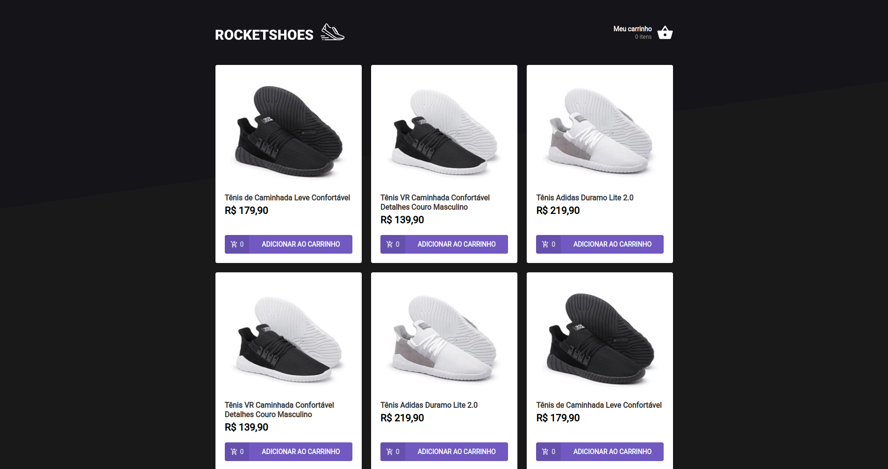

<h1 align="center">Rocketshoes</h1>


### :page_with_curl: About
Front-End de um e-comerce desenvolvido durante as aulas do <a href="https://rocketseat.com.br/gostack">GoStack</a>



### :rocket: Running Locally


```sh
# 1.instale o `json-server`
npm install -g json-server         

# 2.execute o servidor com o json-server
json-server server.json --port 3333

# 3.Abra outra aba do terminal e instale todas as dependencias
yarn install

# 4.para executar o servidor de desenvolvimento
yarn start

Runs the app in development mode.<br>
Open [http://localhost:3000](http://localhost:3000) to view it in the browser.
```


---

<p align="center">
Made with ♥ by <a href="https://www.linkedin.com/in/juliano-sirtori">Juliano</a>
</p>